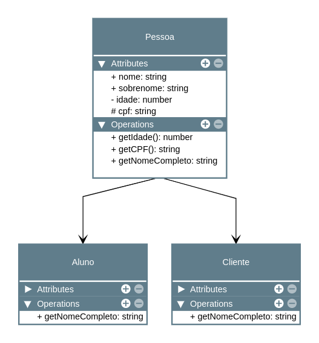

# Herança

Como outras linguagens com recursos orientados a objetos, as classes em JavaScript podem herdar de classes base.

Cláusulas `extends`:

As classes podem estender de uma classe base. Uma classe derivada tem todas as propriedades e métodos de sua classe base e também define membros adicionais.

## Código desenvolvido para exemplificar:

~~~typescript
export class Pessoa {
  constructor(
    public nome: string,
    public sobrenome: string,
    private idade: number,
    protected cpf: string,
  ) {}

  getIdade(): number {
    return this.idade
  }

  getCpf(): string {
    return this.cpf
  }

  getNomeCompleto(): string {
    return this.nome + ' ' + this.sobrenome
  }
}

export class Aluno extends Pessoa {
  getNomeCompleto(): string {
    return 'classe Aluno - ' + this.nome + ' ' + this.sobrenome
  }
}
export class Cliente extends Pessoa {
  getNomeCompleto(): string {
    return 'classe Cliente - ' + this.nome + ' ' + this.sobrenome
  }
}
~~~

---

## Diagrama UML

Para todas as definições e conceitos, foi usado como base a documentação oficial do TypeScript.
